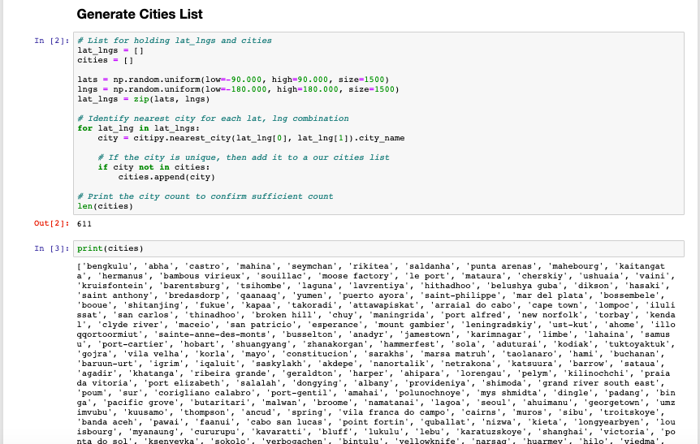
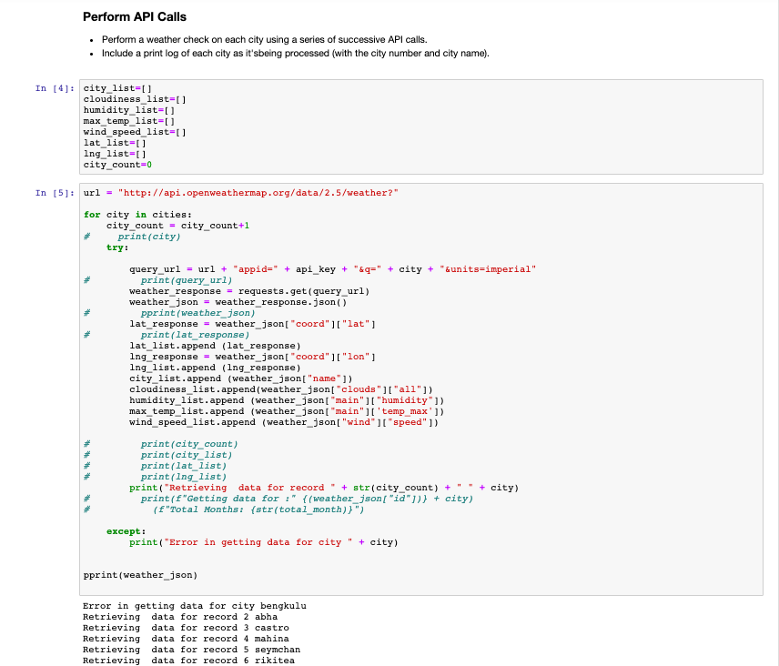
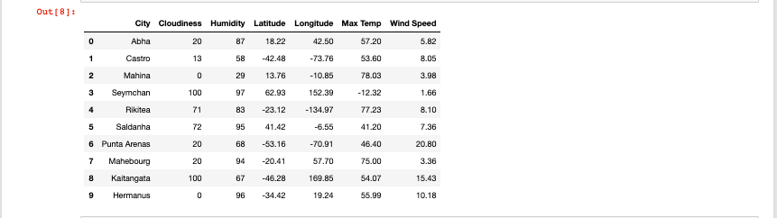
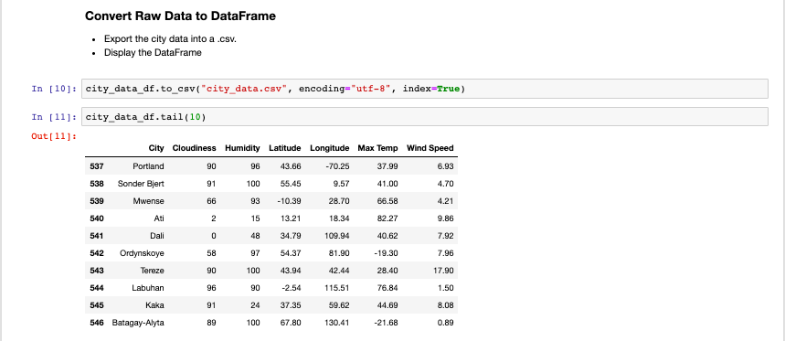
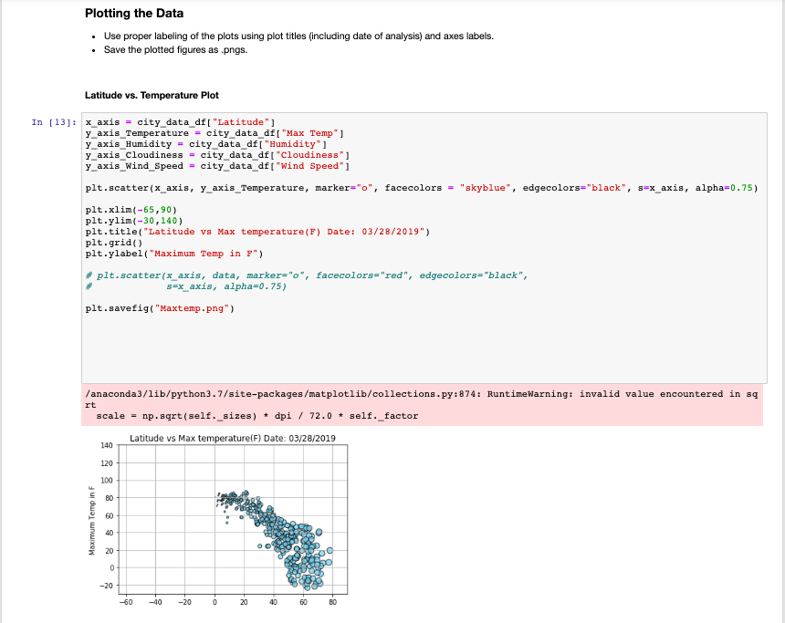
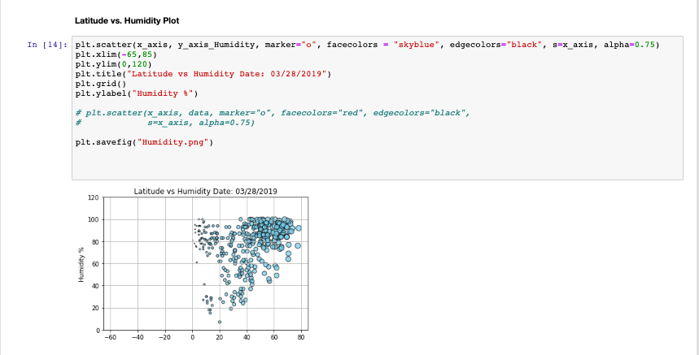
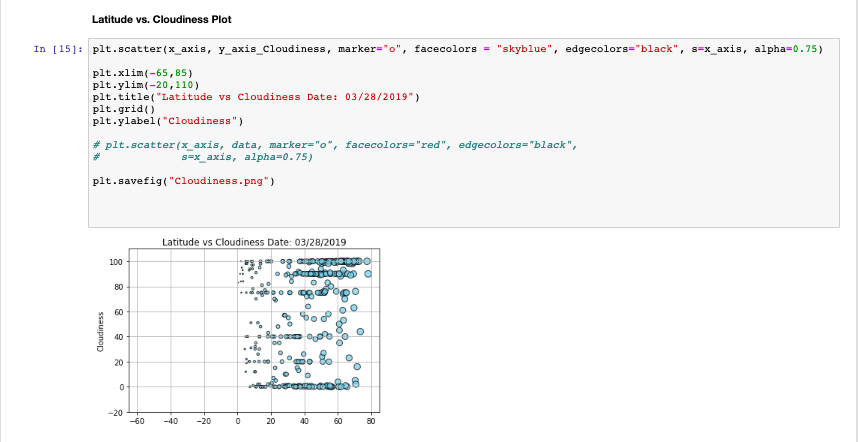
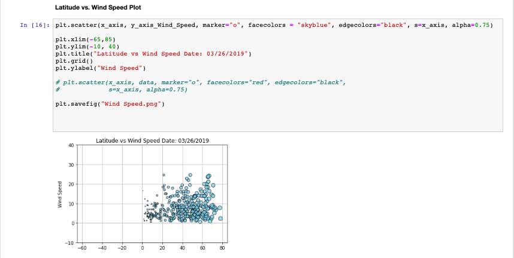

## Getting Weather Data through API and Visualization

### Generate ramdom Worldwide city list 

### Getting json data for each city via API end point

### Plot the scatter charts for temperature

### Plot the scatter charts for humidity

### Plot the scatter charts for cloudiness

### Plot the scatter charts for windspeed

